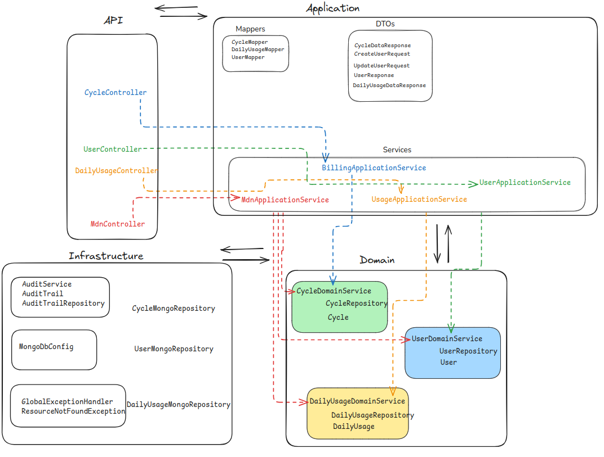
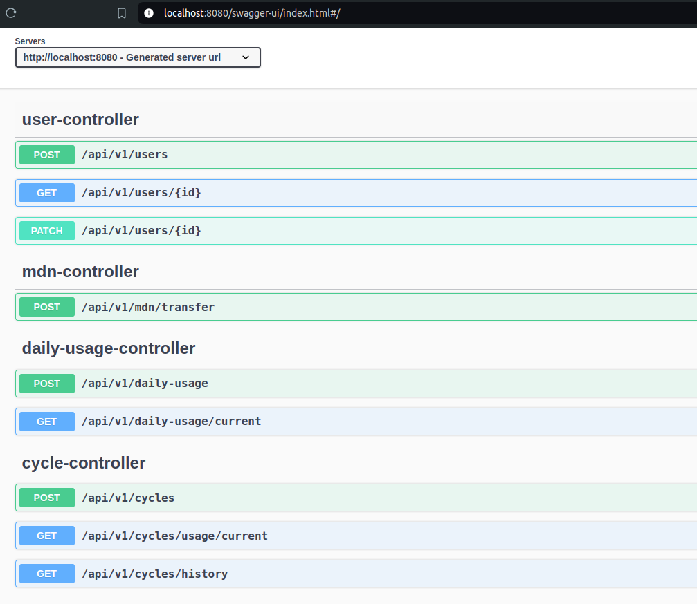

# Architecture

The application is organized into several layers, each responsible for different aspects of the system:

## API Layer (api package)

- Contains REST controllers (`CycleController`, `DailyUsageController`, `MdnController`, `UserController`) that handle
  HTTP requests and responses.

## Application Layer (application package)

- Houses application-specific services (`BillingApplicationService`, `MdnApplicationService`, `UsageApplicationService`
  , `UserApplicationService`) that orchestrate the interaction between the API layer and the domain layer.
- Includes Data Transfer Objects (DTOs) for request and response handling (`CreateUserRequest`, `CycleDataResponse`
  , `DailyUsageDataResponse`, `UpdateUserRequest`, `UserResponse`).
- Contains mappers (`CycleMapper`, `DailyUsageMapper`, `UserMapper`) for converting between domain models and DTOs.

## Domain Layer (domain package)

- The core of the application, containing bounded contexts (`User`, `Billing`, `Usage`) representing key entities.
- Includes domain services (`UserDomainService`, `CycleDomainService`, `DailyUsageDomainService`) that encapsulate
  business logic relevant to specific aggregates.
- Each domain entity has a corresponding repository interface (`CycleRepository`, `UserRepository`
  , `DailyUsageRepository`) for persistence operations. These interfaces are designed to ensure separation of concerns
  and are implemented in the infrastructure layer by concrete implementations extending MongoRepository.

## Infrastructure Layer (infrastructure package)

- Handles cross-cutting concerns such as auditing (`AuditService`, `AuditTrail`, `AuditTrailRepository`),
  configuration (`MongoDbConfig`), exception handling (`GlobalExceptionHandler`, `ResourceNotFoundException`), and
  persistence implementation (`CycleMongoRepository`, `DailyUsageMongoRepository`, `UserMongoRepository`).

# Application Flow

1. **HTTP Requests:** Incoming HTTP requests are processed by controllers in the API layer.
2. **Validation and Delegation:** Controllers validate input data and delegate tasks to the relevant application
   services.
3. **Business Logic:** Application services execute business logic, which involves interaction with the corresponding
   domain services.
4. **Data Access:** Repositories handle data persistence in MongoDB.
5. **Response:** Results are mapped to DTOs and sent back to the client via the API.

## Diagram

See also on excalidraw: https://excalidraw.com/#json=1GHPghUk-_pVS-zaVGG7q,kk52tUPlcu4QyXwP1HiGHA

# Key Components

- **UsmobileApplication:** The main entry point of the application.
- **Controllers:** REST controllers that manage API endpoints.
- **Application Services:** Services that implement business logic and coordinate domain services.
- **Domain Models:** Core entities representing key business concepts.
- **DTOs:** Used for data transfer between the client and server.
- **Mappers:** Facilitate conversion between domain models and DTOs.
- **Repositories:** Interface with MongoDB for data persistence.
- **Audit Service:** Tracks and logs actions performed in the system.

API

You can check out the interactive API documentation using Swagger UI at http://localhost:8080/swagger-ui/index.html#/
after starting the app.
